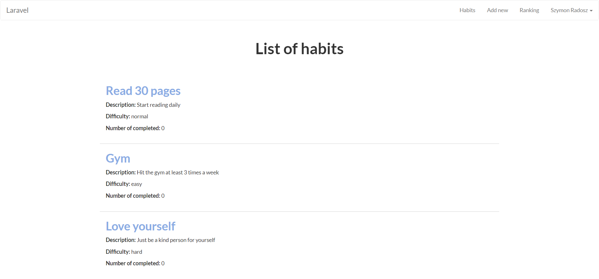
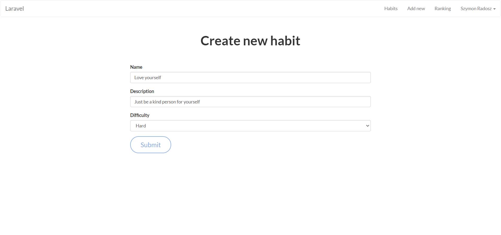

## happ

## Configuration

```
composer update
php artisan key:generate
config mysql database with .env file
php artisan migrate
php artisan serve
```
## Running tests

``` 
./vendor/bin/phpunit
```

## Preview



